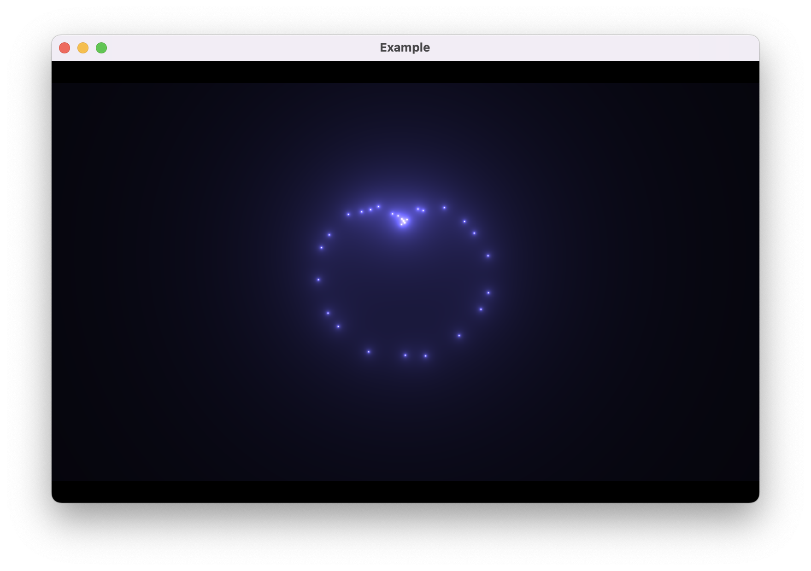
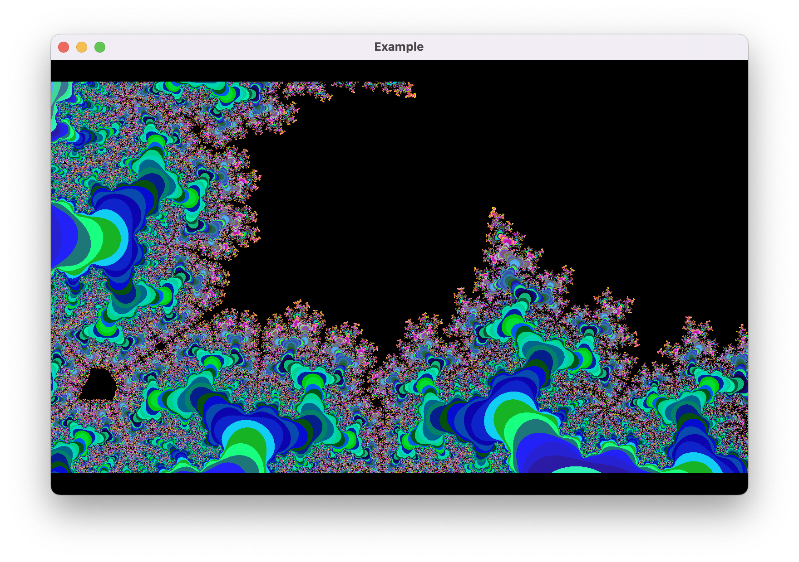

# OpenGL demo

Visually demonstrates a small set of different equations.

## How to Run

1. Make sure `python3` is installed.
2. Install `moderngl-window` lib with the following command: `pip3 install moderngl-window`.

Now you can run: *`python3 main.py`*

## Status:

|Name|Status|
|-|-|
|Cardioid|✅|
|Mandelbort|✅|

### Cardioid

### Mandelbort

### [More is comming](https://en.wikipedia.org/wiki/Gallery_of_curves)